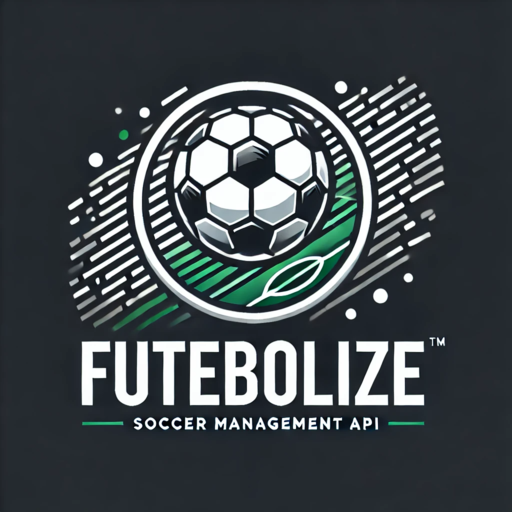

<p align="center"></p>

**Futebolize API** is a robust and scalable RESTful API for soccer management. Provides endpoints for managing teams, players and match schedules, enabling seamless integration with front-end applications and other platforms.

<ul id="content-table" align="left">
    <li><a href="#features">Features</a></li>
    <li><a href="#technologies">Technologies</a></li>
    <li><a href="#how-to-run">How to run</a></li>
</ul>

<h2 id="features" align='left'>📰 Features</h2>

- Manage teams: List, create, update and delete teams, as well as more info about them.
- Manage players: List, create, update and delete players.
- Manage referees: List, create, update and delete referees.
- User authentication: Secure API access using JWT-based authentication.
- API documentation: Swagger-based interactive API documentation.

<h2 id="technologies" align='left'>⚙️ Technologies</h2>

- **Node.js:** Server-side JavaScript runtime.
- **Express:** Web framework for building RESTful APIs.
- **Sequelize:** ORM for handling database operations.
- **SQLite:** Lightweight database for development and testing.
- **bcrypt:** Secure password hashing.
- **jsonwebtoken:** Token-based authentication.
- **dotenv:** Environment variable management.
- **dotenv-cli:** Easy `.env` file handling for different environments in scripts.
- **swagger-jsdoc** & **swagger-ui-express:** API documentation tools.
- **Docker:** Containerization for consistent and scalable deployments.

<h2 id="how-to-run" align='left'>▶️ How to run</h2>

### Prerequisites
- Install [Docker](https://www.docker.com/) on your machine.

1. **Clone the repository:**
   ```bash
   git clone https://github.com/LuanContarin/futebolize-api.git
   cd futebolize-api
   ```
2. **Build the Docker image:** (Make sure you have Docker installed)
    ```bash
    docker build -t futebolize-api .
    ```
3. **Run the Docker container:**
    ```bash
    docker run -p 8080:8080 --name futebolize-api-container futebolize-api
    ```
4. **Access the API:**
    - The API will be running at `http://localhost:8080`
    - The API will be running at `http://localhost:8080/api-docs`.
